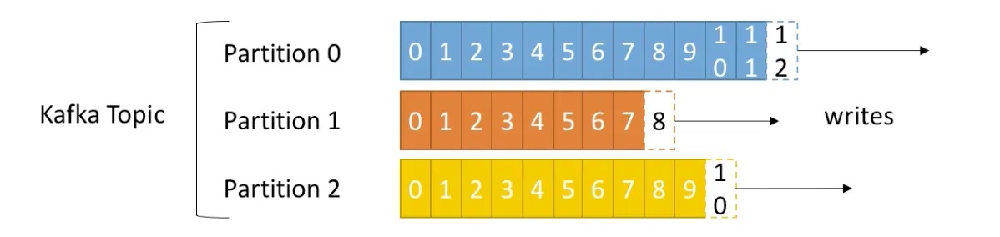
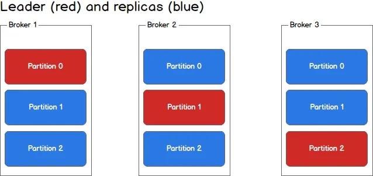
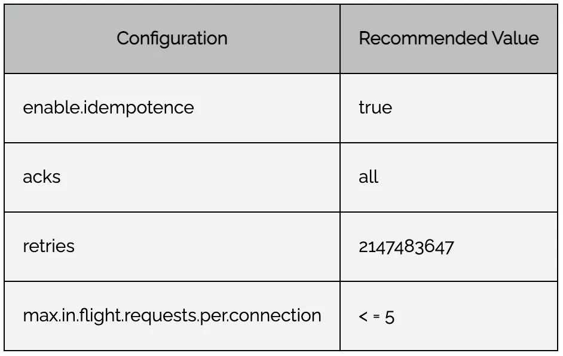

# Kafka

* [Run Kafka in Docker](#run-kafka-in-docker)
* [Base concepts](#base-concepts)
* [Config](#config)

### Run Kafka in Docker

#### Create net

```
docker network create kafkanet
docker network list
```

#### Run ZooKeeper

```
docker run -d --network=kafkanet --name=zookeeper -e ZOOKEEPER_CLIENT_PORT=2181 -e ZOOKEEPER_TICK_TIME=2000 -p 2181:2181 confluentinc/cp-zookeeper
```

#### Run Kafka

```
docker run -d --network=kafkanet --name=kafka -e KAFKA_ZOOKEEPER_CONNECT=zookeeper:2181 -e KAFKA_ADVERTISED_LISTENERS=PLAINTEXT://localhost:9092 -e KAFKA_OFFSETS_TOPIC_REPLICATION_FACTOR=1 -p 9092:9092 confluentinc/cp-kafka
```

#### Check for errors

```
docker logs kafka
```

#### Connect inside Kafka container

```
docker exec -it kafka bash
```

#### Create topic

```
/bin/kafka-topics --create --topic demo-topic --bootstrap-server kafka:9092
```

#### Add partitions

```
/bin/kafka-topics --alter --topic demo-topic --partitions 3 --bootstrap-server kafka:9092
```

#### Show all topics

```
/bin/kafka-topics --list --bootstrap-server kafka:9092
```

#### Show topic description

```
/bin/kafka-topics --describe --topic demo-topic --bootstrap-server kafka:9092
```

#### Generate messages

```
/bin/kafka-console-producer --topic demo-topic --bootstrap-server kafka:9092
>first event
>second event
>^C[appuser@ae44446409c5 ~]$ 
```

#### Generate messages with keys

```
kafka-console-producer --topic demo-topic --property "parse.key=true" --property "key.separator=:" --bootstrap-server kafka:9092
```

#### Read messages

```
/bin/kafka-console-consumer --topic demo-topic --from-beginning --bootstrap-server kafka:9092
```

## Base concepts

* [Topic](#topic)
* [Partitions and Offset](#partitions-and-offset)
* [Brokers](#brokers)
* [Replicas](#replicas)
* [Zookeeper](#zookeeper)
* [Producer](#producer)
* [Consumer](#consumer)
* [Lag](#lag)
* [Message](#message)

### Topic

Similar to a table in database, topics is a particular stream of data.
Topics consist of one or more partitions, ordered, immutable sequences of messages to which Kafka appends new messages.
Fifo ordering (per partition). Default retention time is seven days.

### Partitions and Offset

Topics are split in partitions. Each message within a partition gets an incremental id, called offset.


### Brokers

A Kafka cluster consists of one or more brokers. Partitions are spread across these brokers.
After connecting to any broker, you will be connected to the entire cluster.

### Replicas

Topics have a replication factor to make sure if one broker is down, another broker can serve the data.


### Zookeeper

Zookeeper manages brokers, helps in performing leader election for the partition.
Starting with version 2.8, Kafka can be run without ZooKeeper. The latest version of Kafka uses a new quorum controller.

### Producer

Producers write data to topics.

### Consumer

Consumer read data from a topic.

### Lag

A consumer is lagging when it’s unable to read from a partition as fast as messages are produced to it.
Lag is expressed as the number of offsets that are behind the head of the partition.

The time required to recover from lag depends on how quickly the consumer is able to consume messages per second:

### Message

| Type  | Description              |
|---|--------------------------|
| Key  | (optional) can be null   |
| Value  | can be null              |
| Timestamp  |                          |
| Headers  | (optional) key-value set |

#### Key
if you don’t send the key, the key is set to null then the data will be sent in a Round Robin fashion.
if you have cars and you want to get all the GPS positions in order for that particular car, 
then you need to make sure to have your message key set as the unique identifier for your car i.e carID.
So that we have all the car positions for that one specific car in order as part of the same partition.

## Config

* [Retentions](#retention)
* [Storage](#storage)
* [Replication](#replication)
* [Producer](#producer)
* [Consumer](#consumer)

### Retention

Apache Kafka supports a server-level retention policy that we can tune by configuring exactly one of the 
three time-based configuration properties:

``` 
log.retention.hours
log.retention.minutes
log.retention.ms
```

On the other hand, we get access to the retention.ms property, which we can tune at the topic-level.
Then, we can use this within an alter-topic-config.sh script:
```
#!/bin/sh
. ./functions.sh

alter_topic_retention_config $1 $2 $3
exit $?
```
So, to keep the retention policy effective, we must ensure that the value of the `log.retention.check.interval.ms` 
is lower than the property value of `retention.ms` for any given topic.

### Storage
The basic storage unit of kafka is partition. We can define, where kafka will store these partitions 
by setting `logs.dirs` param.
Kafka is not a permanent data store solution. You can set the maximum time of data retention in kafka also 
you can define maximum amount of data stored in kafka. 
And after one of the limits exceeds, kafka will start purging old messages systematically.
Kafka stores partition in segments so that finding some message and deleting them is easy. 
By default size of a segment is 1 GB.

### Replication
Replication is the process of having multiple copies of the data in case one of the brokers goes down.
Replication factor defines the number of copies of the partition that needs to be kept.
Leader for a partition: For every partition, there is a replica that is designated as the leader. 
The Leader is responsible for sending as well as receiving data for that partition. 
All the other replicas are called the in-sync replicas (or followers) of the partition.

Producers can choose to receive acknowledgements for the data writes to the partition using the “acks” setting.

| Acks  | Description | Notes |
|-------|-----------------|-------|
| 0     | don't wait for any acknowledgements   | possible loss data |
| 1     | wait for leader acknowledgement | partial data loss |
| all   | wait for leader and all in-sync replicas  | no data loss |

While the data is replicated across the follower partitions, the `min.insync.replicas` configuration parameter controls 
the minimum number of these replicas (including the leader) that must successfully write the data to their log file 
when the producer is configured with acks equal to `all`. 
**Usually min.insync.replicas = replicas - 1.** 
Because if one broker is down, we can continue working cause `min.insync.replicas` 
should not greater than available replicas.
If a producer write fails because a node fails resulting in there being insufficient replicas to satisfy 
the min in-sync replicas number, a transient exception denoting there not being enough replicas available is thrown.

### Producer
* `batch.size`: When data reaches the batch size it is sent, until that data will be grouped together. 
Used when speed of data generated is faster than the speed at which data is sent out. Default value is 16384 bytes.
* `linger.ms`: Property set in the producer to delay of sending the batched data. 
There can be a time when data is produced less and sending data immediately will decrease throughput. 
To increase throughput, delay is added while sending data using linger.ms. By default set to 0.

**Records will be sent when either batch size is reached or linger time**

* `compression.type`: Data produced by producer is not compressed by default (value = none). 
The supported compression type by kafka are gzip, snappy and lz4.
* `request.timeout.ms`: Time for which client will wait for the response towards the request. 
By default value is 30s. If response is not received it will try again for n (value of retries) number of time, 
until response is received or reaches the retry limit.
* `retries`: No of time producer will retry to send the message incase of failure ack received. Default value 2147483647.
* `max.in.flight.requests.per.connection`: This property is main and can affect the ordering of messages in the partition/log. 
It represents the number of requests or messages that can be sent without receiving any acknowledgement from the broker. 
If retries are greater than 0, there can be a possibility of a change in orders of the records in the log. 
Suppose the value is set to three, and we sent three batches to the same partition. 
The first batch failed to write and the other batches were written successfully. 
The producer will retry to send the first batch again, resulting in the appearance of the first batch at the end 
of the log (after the second and third batch).
* `enable.idempotence`: default value false. Should set to true if retries value > 0. 
There can be a case when the message was written successfully but the acknowledgement is not received. 
In that case, the producer will try again, resulting in a duplicate record. If enable.idempotence is set to true, 
a unique id will be attached to the message and if it retries broker will check if the message with id is already written or not.



### Consumer
A Consumer Group will manage a set of single consumers, allowing Kafka and the consumers to distribute messages based 
on Kafka partitions. When a consumer group contains just one consumer, it will get all messages from all partitions 
in the Kafka topic.
When a consumer group contains 2 consumers, each consumer in the group will be assigned to half the partitions in the topic.
The consumer group will continue to balance consumers to partitions until the number of consumers is the same as partitions.
Once there are more consumers than partitions, the excess consumers will sit idle and receive no messages.
You can also have multiple Consumer Groups reading from the same topic. 
Each Consumer Group will maintain its own set of offsets and receive messages independently from other consumer groups on the same topic.
Within a single consumer group, a consumer will not receive the same messages as other consumers in the same consumer group.

####  Kafka Consumer Group ID
Each consumer group is identified by a group id. It must be unique for each group, that is, two consumers that have different group ids will not be in the same group.

#### Offset and Commit
Apache Kafka does not have an explicit way of tracking which message has been read by a consumer of a group. 
Instead, it allows consumers to track the offset (the position in the queue) of what messages it has read for a given partition in a topic. 
To do this, a consumer in a consumer group will publish a special message topic for that topic/partition with the committed offset for each partition it has gotten up to.
Apache Kafka stores consumer offsets in a special internal topic called `__consumer_offsets`.

When a new consumer is added to a consumer group, it will start consuming messages from partitions previously assigned to another consumer.
The process of changing which consumer is assigned to what partition is called rebalancing. 
Rebalances are a normal part of Apache Kafka operations and will occur during configuration changes, scaling, 
or if a broker or consumer crashes.

If the Group Coordinator does not see a heartbeat from a consumer within a certain amount of time, it will consider the consumer to be dead and will start a rebalance.
The Group Coordinator will also mark a consumer as dead if it does not get polled by that consumer within a configurable period of time (e.g., 300 seconds).

Kafka Consumers **pull** data from the topic they are listening to.

* `client.id` This will identify the client to the brokers in the Kafka cluster. 
It is used to correlate requests to the client that made them. It is generally recommended that all consumers in the same 
group have the same client ID to enforce client quotas for a single group.
* `session.timeout.ms` Default of 10 seconds. This value specifies the amount of time which the broker needs to get at least 
one heartbeat from the client before it marks the consumer as dead.
* `heartbeat.interval.ms` Default of 3 seconds. This value specifies the frequency in which a consumer will send a heartbeat signal.
* `max.poll.interval.ms` Default 300 seconds. Specifies how long a broker will wait between calls to the poll method causing the consumer 
to try fetching more messages before it marks a consumer as dead.
* `enable.auto.commit` Default enabled. The consumer will automatically commit offsets periodically at the interval 
set by `auto.commit.interval.ms` which is 5 seconds by default.
* `fetch.min.bytes` The minimum amount of data a consumer will fetch from a broker. 
If the broker has less data available than this value, the consumer will wait until more is available. 
This can be used to minimize the backwards and forwards between consumers and brokers (potentially improving throughput) at the expense of latency).
* `fetch.max.wait.ms` The maximum amount of time to wait before fetching messages from the broker. 
Used in conjunction with fetch.min.bytes this can set an upper bound on how long a consumer will wait. 
The consumer will fetch messages from the broker if this value is exceeded
* `max.partition.fetch.bytes` The maximum amount of bytes to fetch on a per partition basis. 
Useful for limiting the upper bound amount of memory a client requires for fetching messages.
* `offset.retention.minutes` Once this retention expires, the consumer committed offset will be reset and the consumer 
won’t be able to find its last committed offset in the ___consumer_offsets topic_. In this case, the consumer can either 
decide to read all data from the topic or the latest data from the topic based on the consumer config `auto.offset.reset`
* `auto.offset.reset` Controls how a consumer will behave when it tries reading a partition that doesn’t have 
a previous last read offset. There are two settings: latest and earliest. 
Latest will start from the latest available message and earliest will start from the earliest available offset.
* `partition.assignment.strategy` The partition assignment strategy controls how the Group Leader consumer will divide 
up partitions between consumers in the consumer group.
* `max.poll.records` Maximum number of records to be fetched in a single poll call. Useful to control throughput within each consumer.


