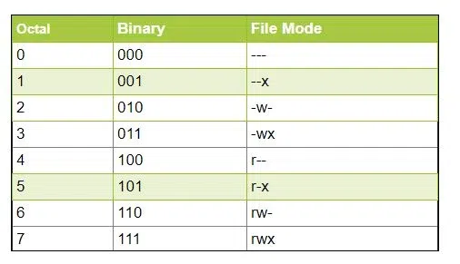

# Linux useful commands 

format linux command: `command keys arguments`

[#linux]

* [Data streams and pipes](#data-streams-and-pipes)
* [Files](#files)
* [Soft and Hard links](#soft-and-hard-links)
* [SSH](#ssh)
* [Permissions in Linux](#permissions-in-linux)
* [System info](#system-info)
* [Bash scripts](#bash-scripts)
* [Cron](#cron)

## Data streams and pipes

### Linux data streams
| Stream        | number | Description  |
|---------------|--------|--------------|
| stdin | 0      | It stands for standard input, and is used for taking text as an input. |
| stdout | 1      | It stands for standard output, and is used to text output of any command you type in the terminal |
| stderr | 2      | It stands for standard error |

```
$ ls -laH > myfile.txt // redirect stdout to file
$ ls -laH 1> myfile.txt // redirect stdout to file using stream number
$ ls -la ddd 2> error.txt // redirect stderr to file
$ $ psql tecmintdb < tecmintdb.sql
```

* **Pipe** is used to pass output to another program or utility.
* **Redirect** is used to pass output to either a file or stream.


### Linux piping commands
The pipe is used to combine two or more commands
```
$ ls | grep file.txt
```

## Files

`pwd` - print working directory

`ls` - (list) show list of all files and dirs. -l long format, -a show all files (inculde hidden that starts with dot .)
ls -l displays the files and folders with permission bits. _If the line starts with a -, it's a file, if it's a directory, it starts with a d_

```
$ ls -1 // display One File Per Line Using
$ ls -lah // long + hidden + human readable 
$ ls -lt // older files based on last modification time
$ ls -ltr // same as above in reverse order
```

`find` a command line utility for walking a file hierarchy. 
It can be used to find files and directories and perform subsequent operations on them.

```
$ find ./GFG -name sample.txt  // It will search for sample.txt in GFG directory. 
$ find ./GFG -name *.txt // search for a file with pattern
$ find ./GFG -name sample.txt -exec rm -i {} \;  // find and delete file with confirmation
$ find ./GFG -empty // search for empty files and directories
$ find ./GFG -perm 664 // search for file with entered permissions
$ find ./ -type f -name "*.txt" -exec grep 'Geek'  {} \; // search for a text with multiple files
```

`touch` It is used to create, change and modify the timestamps of a file. If file is not exists it creates a file without any content.
```
$ touch test
$ touch /tmp/test.txt
$ touch test1 test2 test3 test4 test5
$ touch test{1,2,3,4,5}
$ touch -a fileName // change only access time
$ touch -m fileName // change only modification time
$ touch -d "17 Mar 2023" Geek.txt
$ touch -r second_file_name first_file_name // to use the timestamp of another file
```

`rm` (remove) command is used to remove objects such as files, directories, symbolic links and so on
```
$ rm a.txt
$ rm b.txt c.txt
$ rm -i d.txt // interractive 
$ rm -f e.txt // force for write protected
$ rm -r dir // delete all the files and sub-directories recursively of the parent directory
```

`rmdir` (remove dir) useful when you want to remove the empty directories from the filesystem in Linux

```
$ rmdir mydir1 mydir2 mydir3
$ rmdir -p mydir1/mydir2/mydir3/...../mydirN // including subdirectories
```

`mkdir` (make dir) allows the user to create directories

```
$ mkdir -p first/second/third // create parent if necessary
```

`cp` (copy) stands for a copy. This command is used to copy files or groups of files or directories

```
$ cp Src_file Dest_file
$ cp Src_file1 Src_file2 Src_file3 Dest_directory
$ cp -R Src_directory Dest_directory // recursive copy
```

`mv` (move) Renaming a file or directory. Moving a file or directory to another location.

```
$ mv jayesh_gfg geeksforgeeks // rename file or dir
$ mv geeksforgeeks /home/jayeshkumar/jkj/ // move file
$ mv gfg_1 gfg_2 /home/jayeshkumar/jkj/
```

`head` it prints the first 10 lines of the specified files

```
$ head state.txt
$ head -n 5 state.txt // first 5 lines
$ head -c 6 state.txt // first n bites
$ head -q  state.txt capital.txt // not precceding file name

```

`tail` it prints the last 10 lines of the specified files.

```
$ tail -n 3 state.txt // last 3 lines
$ tail +25 state.txt // starting from line number 25
$ tail -f logfile // update in real time (follow)
```

`grep` (global regular expression print) filter searches a file for a particular pattern of characters, 
and displays all lines that contain that pattern

```
$ grep -i "UNix" geekfile.txt # Case insensitive search
$ grep -c "unix" geekfile.txt # Displaying the count of number of matches
$ grep -l "unix" * // Display the file names that matches the pattern
$ grep -w "unix" geekfile.txt # grep only whole word
$ grep -n "unix" geekfile.txt # show line number while displaying output
$ grep -v "unix" geekfile.txt # invert pattern match (not matching)
$ grep "^unix" geekfile.txt # lines starts with string
$ grep "os$" geekfile.txt # lines that end with a string
$ grep –e "Agarwal" –e "Aggarwal" –e "Agrawal" geekfile.txt # multiple
$ grep -iR geeks /home/geeks # search recursively in directory
$ grep -r "^root:x:" /etc/ 2> /dev/null | grep bash # find file contains line starts with root in /etc/ recursively
```

`wc` stands for word count

```
$ wc state.txt
$ wc -l state.txt // number of lines
$ wc -w state.txt capital.txt // two columns count and word
$ wc -c state.txt // count of bytes
$ wc -m state.txt // displays count of characters

```

`history` command is used to view the previously executed command.

```
$ history 5
$ history | grep chpasswd
$ history -d 1996 // remove command 1996
$ history -c // clean whole history
$ history | tail // last command 
```

`cat` (concatenate) It reads data from the file and gives its content as output

```
$ cat file_name
$ cat file_name1 file_name2
$ cat -n file_name // view content preceding with line number
$ cat > newfile_name // create a file and add content
$ cat filename-whose-contents-is-to-be-copied > destination-filename // copy content
$ cat -s file_name // suppress repeated empty lines
$ cat file1 >> file2 // append content
$ tac file_name // display content in reverse order
```

`less` command is excellent for viewing the contents of a text file in the terminal without cluttering your screen.

```
$ ls -la | less
```
You can perform a backward search with `?pattern` instead of `/pattern`
* You can move to the next matched pattern by pressing the `n` key.
* You can move back to the previous match by pressing the `N` (shift+n) key.
  To run a case-insensitive search, you can enter the following in less view:
```
-I
```
If you want, you can start less with case insensitive mode from the beginning:

```
less -I filename
```
You can only show the matching lines in less by performing the search with `&pattern` instead of `/pattern`

`diff` stands for difference. This command is used to display the differences in the files by comparing the files line by line

Special symbols are:
```
a : add
c : change
d : delete
```

```
$ diff a.txt b.txt
```

```
$ cat file1.txt                                                                                                                            
cat                                                                                                                                              
mv                                                                                                                                               
comm                                                                                                                                             
cp 

$ cat file2.txt                                                                                                                            
cat                                                                                                                                              
cp                                                                                                                                               
diff                                                                                                                                             
comm

$ diff -u file1.txt file2.txt                                                                                                            
--- file1.txt   2018-01-11 10:39:38.237464052 +0000                                                                                              
+++ file2.txt   2018-01-11 10:40:00.323423021 +0000                                                                                              
@@ -1,4 +1,4 @@                                                                                                                                  
 cat                                                                                                                                             
-mv                                                                                                                                              
-comm                                                                                                                                            
 cp                                                                                                                                              
+diff                                                                                                                                            
+comm
```

`lsof` command stands for (List Of Open File). This command provides a list of files that are opened. 
Basically, it gives the information to find out the files which are opened by which process.

```
$ lsof
$ lsof -u username
$ lsof -p process ID
$ lsof -p ^process ID // all other process
$ lsof -R // parent process id
$ lsof -D directory path
$ lsof -i // files opened by network connections
```

`sort` command is used to sort a file, arranging the records in a particular order.

```
$ sort file.txt 
$ sort -o filename.txt inputfile.txt
$ sort -r inputfile.txt // reverse order
$ sort -n filename.txt // numeric sorting
$ sort -k 2n employee.txt // to sort on a certain column. For example, use “-k 2” to sort on the second column. 
$ sort -u filename.txt // to sort and remove duplicates
```

`sed` stands for stream editor and it can perform lots of functions on file like searching, find and replace, insertion or deletion.

```
$ sed 's/unix/linux/' geekfile.txt // replaces the word “unix” with “linux” in the file.
$ sed 's/unix/linux/2' geekfile.txt // replaces the second occurrence of the word “unix” with “linux” in a line
$ sed 's/unix/linux/g' geekfile.txt // to replace all the occurrences of the string in the line.
$ sed 's/unix/linux/3g' geekfile.txt // replace all the patterns from the nth occurrence
$ echo "Welcome To The Geek Stuff" | sed 's/\(\b[A-Z]\)/\(\1\)/g' // Parenthesize first character of each word (W)elcome (T)o (T)he (G)eek (S)tuff
$ sed '3 s/unix/linux/' geekfile.txt // restrict the sed command to replace the string on a specific line number
$ sed '1,3 s/unix/linux/' geekfile.txt // a range of line numbers to the sed command for replacing a string
$ sed '5d' filename.txt // delete 5th line
$ sed '$d' filename.txt // delete last line
$ sed '3,6d' filename.txt // delete lines in range
$ sed '/abc/d' filename.txt // to delete pattern matching line
$ sed G a.txt // insert one blank line after each line
$ sed '/love/G' a.txt // insert a blank line below every line which matches “love”
$ sed 's/^/     /' a.txt // insert 5 spaces to the left of every lines 
```

## Soft and Hard links

A link in UNIX is a pointer to a file. Like pointers in any programming languages, links in UNIX are pointers pointing to a file or a directory. Creating links is a kind of shortcuts to access a file. Links allow more than one file name to refer to the same file, elsewhere.

There are two types of links :

* Hard Links
* Soft Link or Symbolic links

For example, if we have a file a.txt. If we create a hard link to the file and then delete the file, we can still access the file using hard link. But if we create a soft link of the file and then delete the file, we can’t access the file through soft link and soft link becomes dangling.

1. Hard Links
* Each hard linked file is assigned the same Inode value as the original, therefore they reference the same physical file location. Hard links more flexible and remain linked even if the original or linked files are moved throughout the file system, although hard links are unable to cross different file systems.
* ls -l command shows all the links with the link column shows number of links.
* Links have actual file contents
* Removing any link, just reduces the link count, but doesn’t affect other links.
* Even if we change the filename of the original file then also the hard links properly work.
* We cannot create a hard link for a directory to avoid recursive loops.
* If original file is removed then the link will still show the content of the file.
* The size of any of the hard link file is same as the original file and if we change the content in any of the hard links then size of all hard link files are updated.
* The disadvantage of hard links is that it cannot be created for files on different file systems and it cannot be created for special files or directories.

```
$ ln  [original filename] [link name] 
```

2. Soft Links
* A soft link is similar to the file shortcut feature which is used in Windows Operating systems. Each soft linked file contains a separate Inode value that points to the original file. As similar to hard links, any changes to the data in either file is reflected in the other. Soft links can be linked across different file systems, although if the original file is deleted or moved, the soft linked file will not work correctly (called hanging link).
* ls -l command shows all links with first column value l? and the link points to original file.
* Soft Link contains the path for original file and not the contents.
* Removing soft link doesn’t affect anything but removing original file, the link becomes “dangling” link which points to nonexistent file.
* A soft link can link to a directory.
* The size of the soft link is equal to the length of the path of the original file we gave. E.g if we link a file like ln -s /tmp/hello.txt /tmp/link.txt then the size of the file will be 14bytes which is equal to the length of the “/tmp/hello.txt”.
* If we change the name of the original file then all the soft links for that file become dangling i.e. they are worthless now.
* Link across file systems: If you want to link files across the file systems, you can only use symlinks/soft links.

```
$ ln  -s [original filename] [link name]
```

`.` and `..` are similar to the hard links that we discussed above as they increase the link count of an Inode, but we also cannot remove them since they’re built into the filesystem. Moreover, hard links to directories are not possible. Hence we cannot exactly refer to them as hard links, and the more accurate term is “name-inode maps”.

In filesystems, we use the double dot (..) to access the parent directory, whereas the single dot (.) represents the current directory.

## SSH

`ssh` stands for “Secure Shell”. It is a protocol used to securely connect to a remote server/system.

```
$ ssh jayesh@10.143.90.2
$ ssh -p 2222 user@host // connect to port 2222
```

`scp` (secure copy) command in Linux system is used to copy file(s) between servers in a secure way.

```
$ scp test.txt jayesh@10.143.90.2:/home/jayesh // to remote host
$ scp user@remotehost:/home/user/file_name . // from remote host
```

## Permissions in Linux
Linux is a multi-user operating system, so it has security to prevent people from accessing each other’s confidential files.

**Types of file Permissions:**

* User: This type of file permission affects the owner of the file.
* Group: This type of file permission affects the group which owns the file. Instead of the group permissions, the user permissions will apply if the owner user is in this group.
* Other: These types of file permission affect all other users on the system.

To view the permissions we use:

```
ls -l
```

nine characters as three sets of three characters (see the box at the bottom). Each of the three “rwx” characters refers to a different operation you can perform on the file.
```
---     ---     ---
rwx     rwx     rwx
user    group   other
```

`chmod` use to change the security permissions on files

```
$ chmod ugo-rwx xyz.txt // revokes all the read(r), write(w), and execute(x) permission from all user(u), group(g), and others(o) for the file xyz.txt
$ chmod ug+rw,o-x abc.mp4 // adds read(r) and write(w) permission to both user(u) and group(g) and revoke execute(x) permission from others(o) for the file abc.mp4
```

The octal notations
You can also use octal notations like this.




```
$ chmod 777 [file_name] // chmod ugo+rwx [file_name]
$ chmod 666 [file_name] // read write
```

`chown` command is used to change the file Owner or group

```
chown master file1.txt
chown :group1 file1.txt
chown master:group1 file1.txt
```

**User IDs Range Convention**
The Linux Standard Base Core Specification defines three different ranges for user IDs, 
the value from 0 to 99, 100 to 999, and 1000 and above. 
Out of these three ranges, the first two ranges are reserved for system users. 
Therefore, for all the regular users we create, it takes up value in the third range, starting from 1000.

`id` - id command in Linux is used to find out user and group names and numeric ID’s (UID or group ID) of the current user or any other user in the server. This command is useful to find out the following information as listed below:

* User name and real user id.
* Find out the specific Users UID.
* Show the UID and all groups associated with a user.
* List out all the groups a user belongs to.
* Display security context of the current user.pwd - print working directory.
* The Absolute path always starts from the root directory (/). A relative path starts from the current directory.

`passwd` is used to change the user account passwords

```
$ passwd // changing for current user
$ passwd user1 // for user1
$ sudo passwd root // for root 
```

`sudo` (Super User DO) command in Linux is generally used as a prefix for some commands that only superusers are allowed to run. If you prefix any command with “sudo”, it will run that command with elevated privileges or in other words allow a user with proper permissions to execute a command as another user, such as the superuser. This is the equivalent of the “run as administrator” option in Windows. The option of sudo lets us have multiple administrators.

These users who can use the sudo command need to have an entry in the sudoers file located at “/etc/sudoers”. Remember that to edit or view the sudoers file you have to use the sudo command. To edit the sudoers file it is recommended to use the “visudo” command.

```
$ sudo apt-get install package_name
```

`su` (switch user) command enables users to log in as another user, often the root user, 
and access their files and settings. In contrast, the sudo command enables users to run certain commands with 
increased privileges without logging in as the root user. Sudo is a more secure method of granting temporary root privileges to users.


| Difference        | su | su –  |
|---------------|---|--------------|
| Environment Variables | Retains the current user’s environment variables  | Resets the environment variables to those of the target user |
| Working Directory | Keeps the current working directory.  | Changes the working directory to the target user’s home directory. |
| Shell Settings | Retains the current user’s shell settings.  | Resets the shell settings to those of the target user. |
| Path Variable | The target user’s PATH variable is not updated  | The target user’s PATH variable is updated to include the user-specific directories. |


`usermod` command or modify user is a command in Linux that is used to change the properties of a user in Linux through the command line.

The information of a user is stored in the following files:

* /etc/passwd
* /etc/group
* /etc/shadow
* /etc/login.defs
* /etc/gshadow
* /etc/login.defs

When we execute usermod command in terminal the command make the changes in these files itself.
Note: usermod command needs to be executed only as a root user.

```
$ sudo usermod -c "This is test user" test_user // to add comment
$ sudo usermod -d /home/manav test_user // to change home directory of a user
$ sudo usermod -e 2020-05-29 test_user // to change expire date
$ sudo usermod -g manav test_user // to change usergroup
$ sudo usermod -a -G sudo user // add user to group 
$ sudo usermod -l test_account test_user // to change login name
$ sudo usermod -L test_user // to lock user
$ sudo usermod -U test_user // to unlock
$ sudo usermod -u 1234 test_user // to change user id
```
## System info

`systemctl` is used to examine and control the state of “systemd” system and service manager. 
systemd is a system and service manager for Unix-like operating systems (most of the distributions, not all). 
As the system boots up, the first process created, i.e. init process with PID = 1, is systemd system that initiates the userspace services.

```
$ systemctl start sshd # start SSH service
$ systemctl stop sshd # stop service
$ systemctl enable firewalld
$ systemctl disable firewalld
$ systemctl status firewalld
$ systemctl restart sshd
$ systemctl reload httpd
$ systemctl stop --force httpd.service
```

`ps` - for viewing information related with the processes on a system which stands as abbreviation for “Process Status”.

```
$ ps -aux
```

`top` command is used to show the Linux processes. It provides a dynamic real-time view of the running system

```
$ top -n 10 // exit after 10 number of repetition.
$ top -u paras // for specific user
```

* Highlight Running Process in Top: Press ‘z‘ option in running top command will display running process in color which may help you to identified running process easily 
* Shows Absolute Path of Processes: Press ‘c‘ option in running top command, it will display absolute path of running process
* Kill running process: You can kill a process after finding PID of process by pressing ‘k‘ option in running top command without exiting from top window as shown below. 
* Sort by CPU Utilisation: Press (Shift+P) to sort processes as per CPU utilization.

`htop` command like top but more user-friendly

`du` - (disk usage) command is used for estimating file and directory space usage.

```
$ du /home/mandeep/test
$ du -h /home/Mandeep/test // human format
$ du -c -h /home/mandeep/test // to calculate the total size of a directory and its subdirectories
$ du -hs * | sort -h
```

`netstat` - displays various network related information such as network connections, routing tables, interface statistics, masquerade connections, multicast memberships etc

```
$ netstat -at // To list all tcp ports.
$ netstat -l // To list only the listening ports.
$ netstat -pt // To display the PID and program names.
$ netstat -tlnp
```

`ifconfig` - (interface configuration) command is used to configure the kernel-resident network interfaces.

```
$ ifconfig -a // display all the interfaces available, even if they are down.
$ ifconfig interface up // activate the driver for the given interface
$ ifconfig interface down
```

`ip` command in Linux is present in the net-tools which are used for performing several network administration tasks. IP stands for Internet Protocol.

```
$ ip address // to show all IP addresses associated with all network devices
$ ip route // to see the route packets your network will take as set in your routing table. The first entry is the default route.
```

`kill` is used to terminate processes manually
```
$ kill [signal] PID
$ kill -9 1212 // `SIGKILL` signal to kill this PID. SIGKILL has a signal number of `9`
$ kill -l // signal numbers
$ kill 1234 4321 2342 // kill multiple processes
```

SIGTERM, it sends a termination signal to the process which helps in exit gracefully. Whereas SIGKILL sends a kill signal to the process, which terminate the processes forcefully and immediately.

`whereis` command is used to find the location of source/binary file of a command and manuals sections for a specified file in Linux system.

```
$ whereis java
```

`type` command is used to describe how its argument would be translated if used as commands. It is also used to find out whether it is built-in or external binary file.

```
$ type -a pwd
$ type ls
```

## BASH scripts

### Shell

```
$ echo $SHELL // determine shell
```

For example file test.sh First line determine shell where to execute script
```
#!/bin/bash
echo Shell
```

### PATH
The PATH variable is an environment variable containing an ordered list of paths that Linux will search for executables when running a command. Using these paths means that we don’t have to specify an absolute path when running a command.
Linux traverses the colon-separated paths in order until finding an executable. Thus, Linux uses the first path if two paths contain the desired executable.

```
echo $PATH
```

Adding new path
```
$ export PATH=/some/new/path:$PATH # prepend
$ export PATH=$PATH:/some/new/path # append
```

To persist our changes for the current user, we add our export command to the end of ~/.profile. If the ~/.profile file doesn’t exist, we should create it using the touch command:
We can add a new path for all users on a Unix-like system by creating a file ending in .sh in /etc/profile.d/ and adding our export command to this file.

For example, we can create a new script file, /etc/profile.d/example.sh, and add the following line to append /some/new/path to the global PATH:

```
export PATH=$PATH:/some/new/path
```

### Logical Operators
* Logical AND (&&): This is a binary operator, which returns true if both the operands are true otherwise returns false.
* Logical OR (||): This is a binary operator, which returns true is either of the operand is true or both the operands are true and return false if none of then is false.
* Not Equal to (!): This is a unary operator which returns true if the operand is false and returns false if the operand is true.
* (;) execute each command no matter previous command result

```
ls -la && echo "OK"
ls -la notExist || echo "not exist"
ls -la notExist ; echo "all commands no matter result"
```

### for loop 

`````
$ for i in {1..5}; do echo "Hi, $i"; done
$ for i in /etc/*.conf; do cp "$i" /backup; done
$ for var in one two three; do echo "$var"; done
$ for s in $(cat isro-spacecrafts.txt); do echo "Spacecraft is $s"; done
`````

## Cron
You can only run cron jobs once per minute. Every 30 seconds is not possible.

The `crontab` is a list of commands that you want to run on a regular schedule, 
and also the name of the command used to manage that list. Crontab stands for “cron table, ” 
because it uses the job scheduler cron to execute tasks; cron itself is named after “chronos, ” 
the Greek word for time.cron is the system process which will automatically perform tasks for you according to a set 
schedule. The schedule is called the crontab, which is also the name of the program used to edit that schedule. 
Linux Crontab Format

`/etc/crontab` is the system wide crontab.

The format of /etc/crontab is like this:
```
# m h dom mon dow user      command
*   *  *   *   *  someuser  echo 'foo'
```
while crontab -e is per user, it's worth mentioning with no -u argument the crontab command goes to the current users crontab. You can do crontab -e -u <username> to edit a specific users crontab.

Notice in a per user crontab there is no 'user' field.

```
# m h  dom mon dow  command
*   *   *   *   *   echo 'foo'
```

### Crontab Fields and Allowed Ranges (Linux Crontab Syntax)

| Field        | Description | Allowed Value  |
|---------------|---|--------------|
| MIN | Minute field  | 0 to 59 |
| HOUR | Hour field  | 0 to 23 |
| DOM | Day of Month  | 1-31 |
| MON | Month field  | 1-12 |
| DOW | Day Of Week  | 0-6 |
| CMD | Command  | Any command to be executed. |

```
* * * * * /home/maverick/full-backup # every minute
* 02 * * * /home/maverick/full-backup # every minute from 02:00 to 02:59
30 08 10 06 * /home/maverick/full-backup # 30th Minute, 08 AM, 10th Day, 6th Month (June) * – Every day of the week
```

create or edit user crontab
```
$ crontab -e
```
