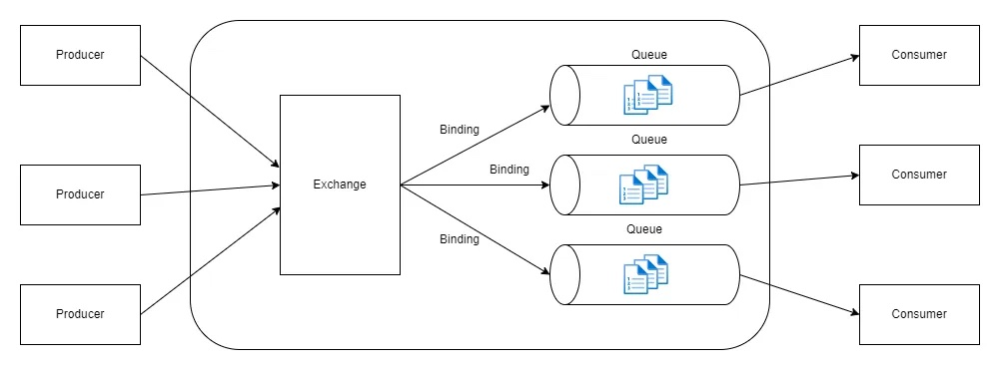

# Rabbit MQ

* [Kafka va MQ](#kafka-va-mq)
* [Run Rabbit MQ](#run-rabbit-mq)
* [List of commands](#list-of-commands)
* [Components](#components)

### Kafka va MQ

| Rabbit MQ                                                                                                                                                                                                                    | Kafka                                                                                                                                                                                                                                                                                                       |
|------------------------------------------------------------------------------------------------------------------------------------------------------------------------------------------------------------------------------|-------------------------------------------------------------------------------------------------------------------------------------------------------------------------------------------------------------------------------------------------------------------------------------------------------------|
| RabbitMQ is a **message broker** initially designed as a message queue or point-to-point communication model.                                                                                                                    | Apache Kafka is a **distributed event streaming platform** that can ingest events from different source systems at scale and store them in a fault-tolerant distributed system called a Kafka cluster.                                                                                                          |
| A **Command** represents a request to be processed. A Command has a sender and one receiver. The receiver must process the command and acknowledge the sender about the outcome, allowing the sender to expect a sense of guarantee. | An **Event** represents a state change of an application. It is expressed in the past tense; it carries necessary information to notify receivers about the state transition (event carried state transfer). Unlike a Command, Events don’t expect a response in return and can be processed by many receivers. |
|                                                                                                                                                                                                    |                                                                                                                                                                                                                                                                                       |
| Messages are transient by default and **deleted from the broker after they are consumed** and acknowledged by consumers. | Messages written to Kafka are durable by default; they are **not deleted after consumption**. Kafka stores messages for a set amount of time and purges messages older than the retention period.  |
| New messages are **pushed** or sent to consumers from the broker in the push model |  Kafka supports only **pull-based** message consumption  |
| Message brokers like ActiveMQ and RabbitMQ offer hierarchical topics, giving consumers more subscription points and flexibility. A hierarchical topic is a structure representing a hierarchy such as /travel/flights/airline/flight-number/seat. Consumers can **subscribe to different hierarchy levels** with different values to select the events at a finer granularity. | Kafka **doesn’t offer that level of granular subscriptions to topics**. A consumer reading from a topic must do the filtering at the consumer level. |
| ActiveMQ offers **total ordering destinations** to preserve message ordering across all consumers for a given topic. Nevertheless, that results in a performance cost since greater synchronization is required. | Kafka has a different take on total message ordering. Kafka ensures that messages with the same partition key will always end up in the same partition regardless of the producer. Messages are written in a partition based on their arrival order, guaranteeing a **strict ordering for messages with the same partition key**.|


### Run Rabbit MQ
```
docker run -p 15672:15672 rabbitmq:3.10.7-management
```

Or we can run using [docker compose](./docker-compose.yml)
```
docker-compose up -d
docker-compose down
```
`disk_free_limit` setting controls how much disk is expected - if you set it to 1000MB, the alarm will be triggered as soon as there is only 1000MB left, rather than waiting until there is only 50MB left.

[rabbit mq ui](http://localhost:15672/)

**credentials**: guest / guest

Run bash inside rabbit container:
```
docker exec -it rabbitmq bash
```
### List of commands
```
root@rabbitmq:/# rabbitmqadmin help
root@rabbitmq:/# rabbitmqadmin -urmuser -prmpassword declare queue name=demo_queue
root@rabbitmq:/# rabbitmqadmin -urmuser -prmpassword list queues
root@rabbitmq:/# rabbitmqadmin -urmuser -prmpassword declare exchange name=demo_exchange type=direct
root@rabbitmq:/# rabbitmqadmin -urmuser -prmpassword list exchanges
root@rabbitmq:/# rabbitmqadmin -urmuser -prmpassword declare binding source=demo_exchange destination=demo_queue routing_key=demo
root@rabbitmq:/# rabbitmqadmin -urmuser -prmpassword list bindings
root@rabbitmq:/# rabbitmqadmin -urmuser -prmpassword publish exchange=demo_exchange payload="test" routing_key="demo"
root@rabbitmq:/# rabbitmqadmin -urmuser -prmpassword list queues
root@rabbitmq:/# rabbitmqadmin -urmuser -prmpassword publish payload="test_without_exchange" routing_key="demo_queue"
root@rabbitmq:/# rabbitmqadmin -urmuser -prmpassword get queue=demo_queue
root@rabbitmq:/# rabbitmqadmin -urmuser -prmpassword get queue=demo_queue count=10
root@rabbitmq:/# rabbitmqadmin -urmuser -prmpassword export backup.json
```

### Components
RabbitMQ comes with the following 4 basic components:
* [Publisher ](#publisher)
* [Message](#message)
* [Exchange](#exchange)
* [Binding](#binding)
* [Queue](#queue)
* [Policies](#policies)
* [Consumer](#consumer)



### Publisher
A publisher is the user application that publishes the messages. 
[Confirming](#https://www.rabbitmq.com/tutorials/tutorial-seven-java.html)
### Message
Message has `payload`, `rounting key`, headers.
Also message has a property called `delivery_mode`.
* Non-persistent (1) -
* Persistent (2) - Messages marked as `persistent` that are delivered to `durable` queues will be logged to disk. 
If message is persistent but not the queue or exchange, that message will not be persisted on disk. 
So to guarantee proper message persistence, you have to declare both exchange & queue as durable, set message delivery mode to persistent.

### Exchange
The broker from the pub-sub mechanism is known as Exchange. It also has a Queue to store messages.
Exchanges take a message from the producer and route it into zero or more queues. 
The routing algorithm used depends on the exchange type and rules called bindings. 
This algorithm also has a routing key associated with it. 
It is nothing but a message attribute added to the message header by the producer. 
We can visualize the routing key as an “address” that the exchange is using to decide how to route the message. 
A message goes to the queue(s) with the binding key that exactly matches the routing key of the message.
There are the following types of exchange types:
* `Direct` exchange: When we have to send messages to queue only when specific key’s (routing key) value matches between them.
* `Fanout` exchange: When we want to broadcast our message So that any queue can receive the message. (~ 30000mps)
* `Topic` exchange: Unlike Direct exchange, they match pattern instead of an exact key. (~ 5000-10000mps)
* `Headers` exchange: The value of the header equals the value specified upon the routing key.
Can be durable or transient. `durable` means that the exchange will survive a RabbitMQ restart. Exchange doesn't keep messages.
### Binding
A binding is a relationship between an exchange and a queue. This can be simply read as: the queue is interested in messages from this exchange.
### Queue
A queue is message storage/buffer for RabbitMQ. When messages flow through RabbitMQ components, they can only be stored inside a queue.
Many producers can send messages that go to one queue, and many consumers can try to receive data from one queue. 
It is essentially only bound by the host’s memory & disk limits.
Queues can be permanent or temporary. A RabbitMQ durable queue’s metadata is stored on a disc, 
whereas a transient queue’s metadata is stored in memory whenever possible.
Usefull parameters:
* `x-message-ttl` - message time to live in milliseconds.
* `x-max-length` - max queue length.
* `x-overflow` - define how to drop messages then max queue length reached (drop-head by default).
* `x-queue-mode` - When the "lazy" queue mode is set, messages in classic queues are moved to disk as early as practically possible.
### Policies
Policies is the recommended way of configuring optional arguments for queues, exchanges, and some plugins.

### Consumer
A consumer is a program that mostly waits to receive messages (i.e. subscribed to the messages). 
Consumer listens for messages from RabbitMQ queues based on different policies attached.
Consumer subscribes to only one queue.
`prefetch count` is a value that tells RabbitMQ how many messages to send to a consumer before starting to listen for acknowledgements.
If it is set to 1, the consumer will need to acknowledge the received message before it will receive the next message.
If it is unset, a consumer will receive all queued messages, and only then RabbitMQ will be expecting acknowledgements. 
If the prefetch count is set to any other number, RabbitMQ will not send more messages before at least one of the sent messages has been acknowledged.

_High or unset prefetch counts may even simply crash the consumer before any processing is done._

When a node delivers a message to a consumer, it has to decide whether the message should be considered handled (or at least received) by the consumer.
* `nack/reject` with `requeue=1` the message will be returned to the queue it came from as though it were a new message; this might be useful in case of a temporary failure on the consumer side
* `nack/reject` with `requeue=0` and a configured Dead Letter Exchange (DLX), will publish the message to that exchange, allowing it to be picked up by another queue
* `nack/reject` with `requeue=0` and `no DLX` will simply discard the message
* `ack` will remove the message from the queue even if a DLX is configured