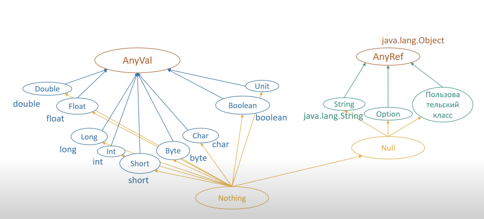

# Scala

* [Worksheet](#worksheet)
* [Basic methods](#basic-methods)

## Worksheet
A worksheet is a Scala file that is evaluated on save, and the result of each expression is shown in a column to the right of your program.

## Basic methods
```scala
3.*(2)
(1: Int).toDouble
1.2.toInt
```
Scala has two types of variables:
+ `val` (value) creates an immutable variable (like final in Java)
+ `var` (variable) creates a mutable variable

blocks
```scala
val v3 = {
  val v1 = 1
  val v2 = v1 + 1
  v2 + 1
}
```

In Scala, the `Unit` type is a subtype of the AnyVal type. It denotes a method that doesn't return any meaningful result
```scala
var v4 = {}
v4 == ()
```

```scala
def ??? : Nothing = throw new NotImplementedError
```
If we don't want implement method we can use `???`
```scala
def f(a: String): String = ???  
```

