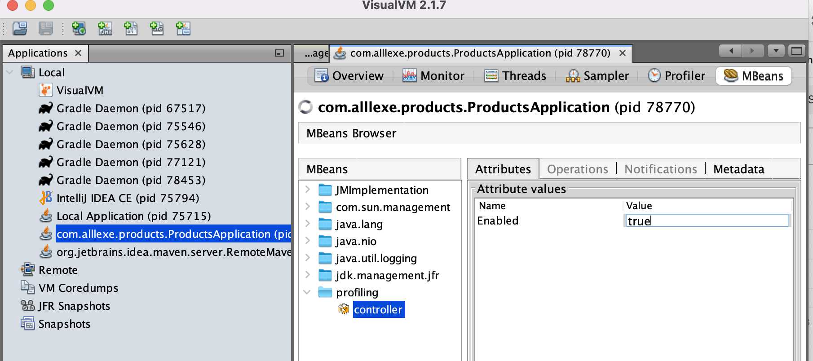

# Spring

* [ShedLock](#shedlock)
* [Pointcut](#pointcut)
* [Advice](#advice)
* [Custom AOP Annotation](#custom-aop-annotation)
* [Circular Dependencies](#circular-dependencies)
* [Read only](#read-only)
* [Custom annotation with a bean post-processor](#custom-annotation-with-a-bean-post-processor)
* [Profiling with MBean and BPP](#profiling-with-mbean-and-bpp)
* [Running logic after the Spring context has been initialized](#running-logic-after-the-spring-context-has-been-initialized)

## ShedLock
Spring provides an easy way to implement API for scheduling jobs. It works great until we deploy multiple instances of our application.

Spring, by default, cannot handle scheduler synchronization over multiple instances. It executes the jobs simultaneously on every node instead.
ShedLock — a Java library that makes sure our scheduled tasks run only once at the same time and is an alternative to Quartz.
[ShedLock](https://www.baeldung.com/shedlock-spring)

## Pointcut
A join point is a step of the program execution, such as the execution of a method or the handling of an exception. 
In Spring AOP, a join point always represents a method execution. 
A pointcut is a predicate that matches the join points, and the pointcut expression language is a way of describing pointcuts programmatically.

A pointcut expression can appear as a value of the @Pointcut annotation:
```
@Pointcut("within(@org.springframework.stereotype.Repository *)")
public void repositoryClassMethods() {}
```
The method declaration is called the pointcut signature. 
It provides a name that advice annotations can use to refer to that pointcut:
```
@Around("repositoryClassMethods()")
public Object measureMethodExecutionTime(ProceedingJoinPoint pjp) throws Throwable {
    ...
}
```
A pointcut expression starts with a **pointcut designator (PCD)**, which is a keyword telling Spring AOP what to match.

### execution
The primary Spring PCD is execution, which matches method execution join points:
```
@Pointcut("execution(public String com.baeldung.pointcutadvice.dao.FooDao.findById(Long))")
```
we can use wildcards
```
@Pointcut("execution(* com.baeldung.pointcutadvice.dao.FooDao.*(..))")
```
### within
limits matching to join points of certain types:
```
@Pointcut("within(com.baeldung.pointcutadvice.dao.FooDao)")
```
```
@Pointcut("within(com.baeldung..*)")
```
### this and target
```
public class FooDao implements BarDao {
    ...
}
```
`this` limits matching to join points where the bean reference is an instance of the given type
```
@Pointcut("this(com.baeldung.pointcutadvice.dao.FooDao)")
```
`target` limits matching to join points where the target object is an instance of the given type
```
@Pointcut("target(com.baeldung.pointcutadvice.dao.BarDao)")
```
### args
We can use this PCD for matching particular method arguments
```
@Pointcut("execution(* *..find*(Long))")
```
### @target
The `@target` PCD limits matching to join points where the class 
of the executing object has an annotation of the given type:
```
@Pointcut("@target(org.springframework.stereotype.Repository)")
```
### Combining Pointcut Expressions
Pointcut expressions can be combined using `&&,` `||`, and `!` operators:
```
@Pointcut("@target(org.springframework.stereotype.Repository)")
public void repositoryMethods() {}

@Pointcut("execution(* *..create*(Long,..))")
public void firstLongParamMethods() {}

@Pointcut("repositoryMethods() && firstLongParamMethods()")
public void entityCreationMethods() {}
```

## Advice
**Advice** is an action taken by an aspect at a particular join point. 
Different types of advice include “**around**,” “**before**” and “**after**” advice. 
The main purpose of aspects is to support cross-cutting concerns, such as logging, profiling, caching, and transaction management.

With Spring, you can declare advice using AspectJ annotations, but you must first apply 
the @EnableAspectJAutoProxy annotation to your configuration class, which will enable support 
for handling components marked with AspectJ’s @Aspect annotation.

```
@Configuration
@EnableAspectJAutoProxy
public class AopConfiguration {
    ...
}
```

In Spring Boot projects, we don’t have to explicitly use the @EnableAspectJAutoProxy. 
There’s a dedicated AopAutoConfiguration that enables Spring’s AOP support if the Aspect or Advice is on the classpath.

* [Before Advice](#before-advice)
* [After Advice](#after-advice)
* [Around Advice](#around-advice)

### Before Advice
```
@Component
@Aspect
public class LoggingAspect {

    private Logger logger = Logger.getLogger(LoggingAspect.class.getName());

    @Pointcut("@target(org.springframework.stereotype.Repository)")
    public void repositoryMethods() {};

    @Before("repositoryMethods()")
    public void logMethodCall(JoinPoint jp) {
        String methodName = jp.getSignature().getName();
        logger.info("Before " + methodName);
    }
}
```

### After Advice
After advice, declared by using the `@After` annotation, is executed after a matched method’s execution, 
whether or not an exception was thrown.
In some ways, it is similar to a finally block. In case you need advice to be triggered only after normal execution, 
you should use the returning advice declared by `@AfterReturning` annotation. 
If you want your advice to be triggered only when the target method throws an exception, 
you should use throwing advice, declared by using the `@AfterThrowing` annotation.
```
@Component
@Aspect
public class PublishingAspect {

    private ApplicationEventPublisher eventPublisher;

    @Autowired
    public void setEventPublisher(ApplicationEventPublisher eventPublisher) {
        this.eventPublisher = eventPublisher;
    }

    @Pointcut("@target(org.springframework.stereotype.Repository)")
    public void repositoryMethods() {}

    @Pointcut("execution(* *..create*(Long,..))")
    public void firstLongParamMethods() {}

    @Pointcut("repositoryMethods() && firstLongParamMethods()")
    public void entityCreationMethods() {}

    @AfterReturning(value = "entityCreationMethods()", returning = "entity")
    public void logMethodCall(JoinPoint jp, Object entity) throws Throwable {
        eventPublisher.publishEvent(new FooCreationEvent(entity));
    }
}
```
### Around Advice
Around advice can perform custom behavior both before and after the method invocation. 
It’s also responsible for choosing whether to proceed to the join point or to shortcut the advised method execution 
by providing its own return value or throwing an exception.
```
@Aspect
@Component
public class PerformanceAspect {

    private Logger logger = Logger.getLogger(getClass().getName());

    @Pointcut("within(@org.springframework.stereotype.Repository *)")
    public void repositoryClassMethods() {};

    @Around("repositoryClassMethods()")
    public Object measureMethodExecutionTime(ProceedingJoinPoint pjp) throws Throwable {
        long start = System.nanoTime();
        Object retval = pjp.proceed();
        long end = System.nanoTime();
        String methodName = pjp.getSignature().getName();
        logger.info("Execution of " + methodName + " took " + 
          TimeUnit.NANOSECONDS.toMillis(end - start) + " ms");
        return retval;
    }
}
```

## Custom AOP Annotation

Let’s create our annotation
```
@Target(ElementType.METHOD)
@Retention(RetentionPolicy.RUNTIME)
public @interface LogExecutionTime {

}
```

Create execution
```
@Aspect
@Component
public class ExampleAspect {
    
    @Around("@annotation(LogExecutionTime)")
    public Object logExecutionTime(ProceedingJoinPoint joinPoint) throws Throwable {
        long start = System.currentTimeMillis();
    
        Object proceed = joinPoint.proceed();
    
        long executionTime = System.currentTimeMillis() - start;
    
        System.out.println(joinPoint.getSignature() + " executed in " + executionTime + "ms");
        return proceed;
    }
}

```

Using
```
@LogExecutionTime
public void serve() throws InterruptedException {
    Thread.sleep(2000);
}
```

## Circular Dependencies
With a circular dependency, Spring cannot decide which of the beans should be created first since they depend on one another. 
In these cases, Spring will raise a `BeanCurrentlyInCreationException` while loading context.
It can happen in Spring when using **constructor injection**. If we use other types of injections, 
we shouldn’t have this problem since the dependencies will be injected when they are needed and not on the context loading.

### Redesign
When we have a circular dependency, it’s likely we have a design problem and that the responsibilities are not well separated. 
We should try to redesign the components properly so that their hierarchy is well designed and there is no need for circular dependencies.

### Use @Lazy
```
    @Autowired
    public CircularDependencyA(@Lazy CircularDependencyB circB) {
        this.circB = circB;
    }
```

### Use Setter/Field Injection
```
@Component
public class CircularDependencyA {

    private CircularDependencyB circB;

    @Autowired
    public void setCircB(CircularDependencyB circB) {
        this.circB = circB;
    }

    public CircularDependencyB getCircB() {
        return circB;
    }
}
```

### Use @PostConstruct

```
@Component
public class CircularDependencyA {

    @Autowired
    private CircularDependencyB circB;

    @PostConstruct
    public void init() {
        circB.setCircA(this);
    }

    public CircularDependencyB getCircB() {
        return circB;
    }
}
```

### Implement ApplicationContextAware and InitializingBean

If one of the beans implements ApplicationContextAware, the bean has access to Spring context and can extract the other bean from there.
```
@Component
public class CircularDependencyA implements ApplicationContextAware, InitializingBean {

    private CircularDependencyB circB;

    private ApplicationContext context;

    public CircularDependencyB getCircB() {
        return circB;
    }

    @Override
    public void afterPropertiesSet() throws Exception {
        circB = context.getBean(CircularDependencyB.class);
    }

    @Override
    public void setApplicationContext(final ApplicationContext ctx) throws BeansException {
        context = ctx;
    }
}
```

## Read only
Read intense applications can leverage those optimizations and save resource utilization on our database cluster.
In a more real-life scenario, we could have two data sources, a writer one and a read-only one. 
Then, we’d have to define which data source to use at the component level. 
This approach handles the read connections more efficiently and prevents the unnecessary commands used to ensure 
the session is clean and has the appropriate setup.

[Read only](https://www.baeldung.com/spring-transactions-read-only)

## Custom annotation with a bean post-processor

Let's create custom annotation implemented generation random number.
Don't forget to set `RetentionPolicy.RUNTIME`
```
@Retention(RetentionPolicy.RUNTIME)
public @interface InjectRandomInt {
    int min();
    int max();
}
```
apply this annotation for class
```
@Component
public class TerminatorQuoter implements Quoter {

    @InjectRandomInt(min = 2, max = 8)
    private int repeat;

    @Override
    public void sayQuote() {
        for (int i = 0; i < repeat; i++) {
            System.out.println("I'll be back");
        }
    }
}
```
Implement our annotation behavior
```
public class InjectRandomIntAnnotationPostProcessor implements BeanPostProcessor {
    @Override
    public Object postProcessBeforeInitialization(Object bean, String beanName) throws BeansException {
        Field[] declaredFields = bean.getClass().getDeclaredFields();
        for (Field field: declaredFields) {
            InjectRandomInt annotation = field.getAnnotation(InjectRandomInt.class);
            if (annotation != null) {
                int min = annotation.min();
                int max = annotation.max();
                Random random = new Random();
                int i = min + random.nextInt(max - min);
                field.setAccessible(true);
                ReflectionUtils.setField(field, bean, i);
            }
        }
        return bean;
    }
```
Add our class to spring context
```
    @Bean
    InjectRandomIntAnnotationPostProcessor injectRandomIntAnnotationPostProcessor() {
        return new InjectRandomIntAnnotationPostProcessor();
    }
```


Execution methods order for bean initialization:
* `Object postProcessBeforeInitialization(Object bean, String beanName)`
* init-method `@Init`
* afterPropertiesSet
* `@PostConstruct`
* `Object postProcessAfterInitialization(Object bean, String beanName)`

## Profiling with MBean and BPP

Create annotation Profiling
```
@Retention(RetentionPolicy.RUNTIME)
public @interface Profiling {

}
```

Create controller for remote turn on and off profiling via MBean
```
public interface ProfilingControllerMBean {
    void setEnabled(boolean enabled);
}
```
and
```
public class ProfilingController implements ProfilingControllerMBean {
    private boolean isEnabled;

    public boolean isEnabled() {
        return isEnabled;
    }

    public void setEnabled(boolean enabled) {
        isEnabled = enabled;
    }
}
```
Create bean post processor for handle annotation
```
public class ProfilingHandlerAnnotationPostProcessor implements BeanPostProcessor {
    private Map<String, Class> map = new HashMap<>();
    private ProfilingController controller = new ProfilingController();

    public ProfilingHandlerAnnotationPostProcessor() throws Exception {
        MBeanServer mBeanServer = ManagementFactory.getPlatformMBeanServer();
        mBeanServer.registerMBean(controller, new ObjectName("profiling", "name", "controller"));
    }

    @Override
    public Object postProcessBeforeInitialization(Object bean, String beanName) throws BeansException {
        Class<?> beanClass = bean.getClass();
        if (beanClass.isAnnotationPresent(Profiling.class)) {
            map.put(beanName, beanClass);
        }
        return bean;
    }

    @Override
    public Object postProcessAfterInitialization(Object bean, String beanName) throws BeansException {
        Class beanClass = map.get(beanName);
        if (beanClass != null) {
            return Proxy.newProxyInstance(beanClass.getClassLoader(), beanClass.getInterfaces(), (proxy, method, args) -> {
                if (controller.isEnabled()) {
                    System.out.println("Start profiling...");
                    long before = System.nanoTime();
                    Object rVal = method.invoke(bean, args);
                    long profilingTime = System.nanoTime() - before;
                    System.out.println("Profiling time: "+ profilingTime);
                    System.out.println("Finish profiling");
                    return rVal;
                } else {
                    return method.invoke(bean, args);
                }
            });
        }
        return bean;
    }
}
```

Run application

* Install VisualVM
* Open VisualVM and connect to our application java process
* Add plugin: tools -> plugins -> add plugin VisualVM-MBeans
* Change value to true and check profiling data in log



## Running logic after the Spring context has been initialized

Run method after annotation context is ready.

Create annotation
```
@Retention(RetentionPolicy.RUNTIME)
public @interface PostProxy {

}
```

Create class implemented ApplicationListener

```
public class PostProxyInvokerContextListener implements ApplicationListener<ContextRefreshedEvent> {
    @Autowired
    private ConfigurableListableBeanFactory beanFactory;

    @Override
    public void onApplicationEvent(ContextRefreshedEvent event) {
        ApplicationContext applicationContext = event.getApplicationContext();
        for (String beanName : applicationContext.getBeanDefinitionNames()) {
            BeanDefinition beanDefinition = beanFactory.getBeanDefinition(beanName);
            String originalClassNameBeforeProxy = beanDefinition.getBeanClassName();
            try {
                Class<?> beanOriginalClass = Class.forName(originalClassNameBeforeProxy);
                Method[] methods = beanOriginalClass.getMethods();
                for (Method method: methods) {
                    if (method.isAnnotationPresent(PostProxy.class)) {
                        Object bean = applicationContext.getBean(beanName);
                        Method currentMethod = bean.getClass().getMethod(method.getName(), method.getParameterTypes());
                        currentMethod.invoke(bean);
                    }
                }
            } catch (Exception e) {
                throw new RuntimeException(e);
            }

        }
    }
}
```

## Replace bean by annotation value
**Don't use in production mode**
Create annotation
```
public @interface DeprecatedClass {
    Class newImpl();
}
```
Create new class
```
@Component
public class T1000 extends TerminatorQuoter {
    @Override
    public void sayQuote() {
        System.out.println("I'm liquid");
    }
}
```
Mark original class with annotation
```
@Component
@DeprecatedClass(newImpl = T1000.class)
public class TerminatorQuoter implements Quoter {

    @InjectRandomInt(min = 2, max = 8)
    private int repeat;

    @Override
    public void sayQuote() {
        for (int i = 0; i < repeat; i++) {
            System.out.println("I'll be back");
        }
    }
}
```
Create BeanFactoryPostProcessor. It will replace our original class with new class from annotation before bean would be created.
```
public class DeprecationHandlerBeanFactoryPostProcessor implements BeanFactoryPostProcessor {
    @Override
    public void postProcessBeanFactory(ConfigurableListableBeanFactory configurableListableBeanFactory) throws BeansException {
        String[] beanDefinitionNames = configurableListableBeanFactory.getBeanDefinitionNames();
        for (String beanName: beanDefinitionNames) {
            BeanDefinition beanDefinition = configurableListableBeanFactory.getBeanDefinition(beanName);
            String beanClassName = beanDefinition.getBeanClassName();
            try {
                Class<?> beanClass = Class.forName(beanClassName);
                DeprecatedClass annotation = beanClass.getAnnotation(DeprecatedClass.class);
                if (annotation != null) {
                    beanDefinition.setBeanClassName(annotation.newImpl().getName());
                }
            } catch (Exception e) {
                System.out.println(e);
            }
        }
    }
}
```
Register `DeprecationHandlerBeanFactoryPostProcessor` in context
